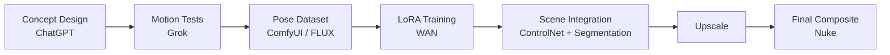
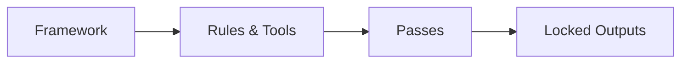
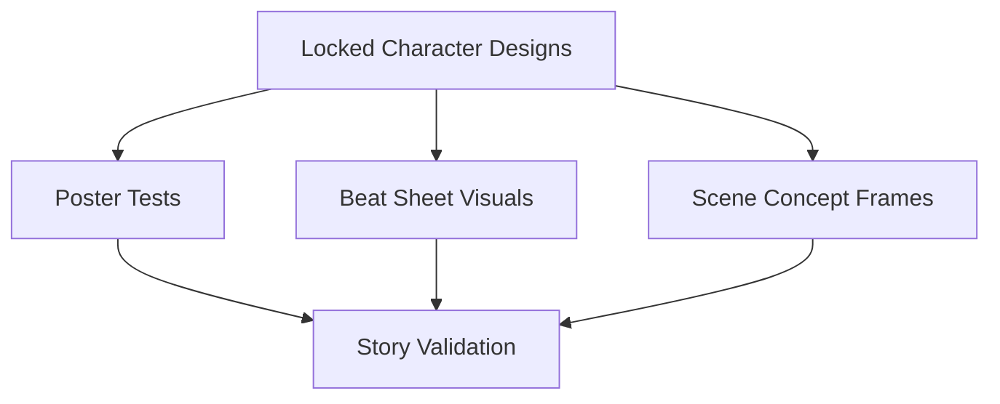
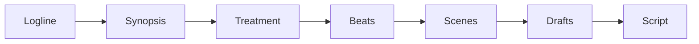
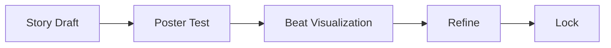
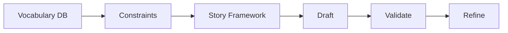
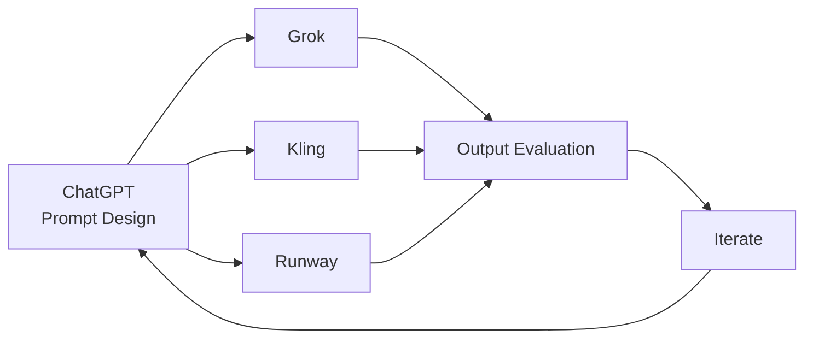
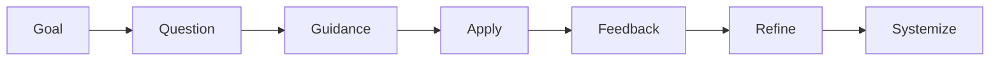

# AI Workflow Systems

Designing structured, multimodal AI workflow systems that translate creative intent into production-ready outputs across visual, narrative, technical, and product domains.

---

## Overview

This repository showcases a collection of **AI workflow systems** built to solve real-world problems across:

* Visual effects & multimodal generation
* Narrative development & creative systems
* Data-driven content pipelines
* Product & venture design
* Investigative analysis

The focus is not on individual tools, but on **how tools are orchestrated into repeatable, reliable systems**.

---

## Core Capabilities

* Multimodal pipeline design (text → image → video → VFX)
* Structured prompt engineering
* Dataset creation & LoRA training
* Cross-platform orchestration (ComfyUI, Runway, Grok, Kling)
* Narrative system design
* Database-driven content generation
* Workflow debugging & optimization
* AI-assisted research & product development

---

# Flagship Workflows

---

## 1. Multimodal Creature Pipeline

**Objective:**
Create a consistent AI-generated character and integrate it into live-action footage.

### Pipeline Flow

### Visuals to Include

* Hero design image
* Dataset grid (2x3 poses)
* Motion test stills
* ComfyUI node graph
* Before/after composite

### Key Insights

* LoRA enables cross-shot consistency
* AI generation + traditional VFX = production quality
* Early motion testing prevents downstream failure

---

## 2. Story Development System

**Objective:**
Develop narrative IP using a structured, repeatable AI-assisted framework.

### System Flow

### Character Identity Layer

### Pass Progression

### Validation Loop

### Visuals to Include

* Poster samples
* Beat sheet visuals
* Character design sheets
* Scene concept frames

### Key Insights

* Prevents narrative drift in long-form projects
* Uses visual validation to test tone early
* Maintains character consistency across all outputs

---

# Applied Systems

---

## 3. Prism Vocabulary Engine + Narrative Integration

**Objective:**
Combine a database-driven vocabulary system with narrative development workflows.

### System Flow

### Integration Loop

### Visuals to Include

* Database schema diagram
* Query output tables
* Word usage tracking
* Story + vocabulary alignment examples

### Key Insights

* Data directly shapes creative output
* Enables scalable book production
* Demonstrates multi-system integration

---

## 4. Cross-Platform Video Generation Pipeline

**Objective:**
Generate and refine video outputs using multiple AI platforms.

### Workflow

### Visuals to Include

* Side-by-side platform comparisons
* Motion test frames
* Prompt vs output examples

### Key Insights

* Each platform has different strengths
* Iteration is required for quality control

---

# Technical Systems

---

## 5. ComfyUI Debugging & Optimization

**Objective:**
Stabilize and optimize complex AI pipelines under hardware constraints.

### Debug Flow

### Visuals to Include

* Node graph before/after
* Error logs with fixes
* Performance comparisons

### Key Insights

* Debugging is essential for production readiness
* Hardware constraints shape workflow design

---

# Additional Systems

---

## 6. Research → Product Framework

* Deep research → system design → prototype architecture

## 7. STEAM PNKS Venture System

* Educational + community platform design

## 8. Dynamic Keyboard Concept

* AI-assisted product ideation

## 9. Forensic Analysis / Follow the Money

* Financial flow mapping
* Narrative deconstruction

---

# Meta System

---

## 10. AI-Assisted Personal Coaching System

**Objective:**
Use ChatGPT as a continuous learning and execution engine.

### Learning Loop

### Key Insights

* AI accelerates skill acquisition
* Learning is integrated directly into production workflows

---

# Workflow Design Principles

---

### Evaluation & Validation

* Outputs are tested across visual, narrative, and technical layers

### Modularity

* Workflows are reusable and portable across projects

### Human-in-the-Loop

* Critical decisions are guided, not automated

---

# Closing

These systems demonstrate a unified approach to AI:

> Not as isolated tools, but as structured, validated, and reusable workflow systems.

---

## Next Steps (Optional Enhancements)

* Add embedded videos (Grok / Kling outputs)
* Add interactive diagrams (Mermaid / images)
* Expand case studies with deeper breakdowns
