# AI Workflow Systems

Designing structured, multimodal AI workflow systems that translate creative intent into production-ready outputs across visual, narrative, technical, and product domains.

---

## Overview

This repository showcases a collection of **AI workflow systems** built to solve real-world problems across:

* Visual effects & multimodal generation
* Narrative development & creative systems
* Data-driven content pipelines
* Product & venture design
* Investigative analysis

The focus is not on individual tools, but on **how tools are orchestrated into repeatable, reliable systems**.

---

## Core Capabilities

---

* Multimodal pipeline design (text → image → video → VFX)
* Structured prompt engineering
* Dataset creation & LoRA training
* Cross-platform orchestration (ComfyUI, Runway, Grok, Kling)
* Narrative system design
* Database-driven content generation
* Workflow debugging & optimization
* AI-assisted research & product development

---

# Flagship Workflows

---

---

## Multimodal Creature Pipeline

**Objective:**
Create a consistent AI-generated character and integrate it into live-action footage.

### Pipeline Flow

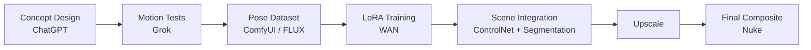

### Visuals

**Hero Design**

**Dataset (Pose Grid)**
 

**Motion Tests (Grok)**
[▶ Watch Motion Test Video](YOUTUBE_LINK_HERE)

**ComfyUI Node Graph**

**Before / After Composite**

|---|---|
|  |  |

### Key Insights

* LoRA enables cross-shot consistency
* AI generation + traditional VFX = production quality
* Early motion testing prevents downstream failure

### Bespoke Effects with Runway

|---|---|
| 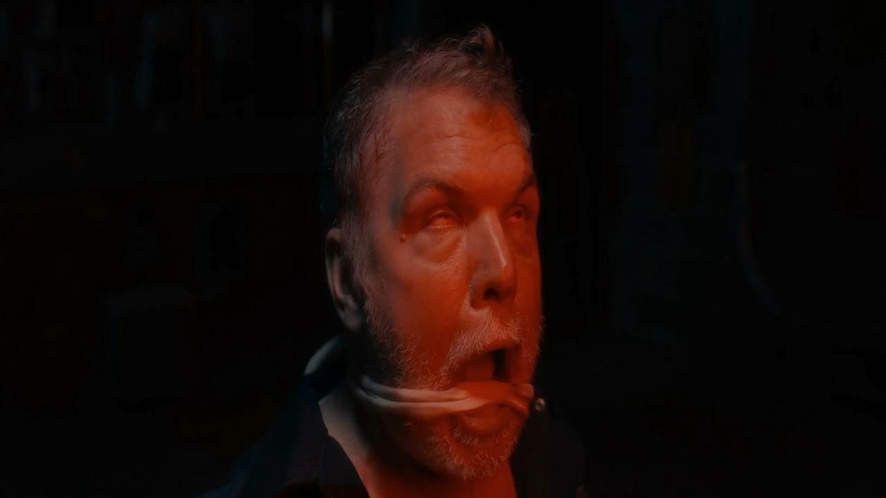 | 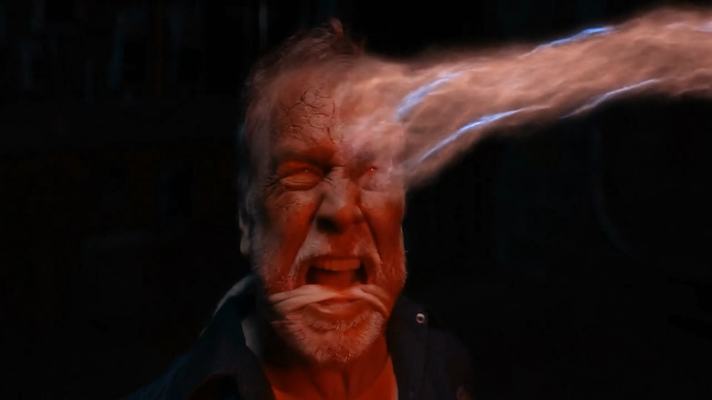 |

---

## Story Development System

**Objective:**
Develop narrative IP using a structured, repeatable AI-assisted framework.

### System Flow

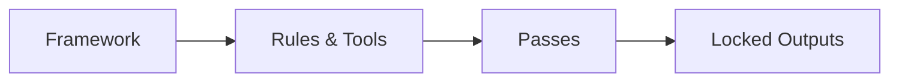

### Character Identity Layer

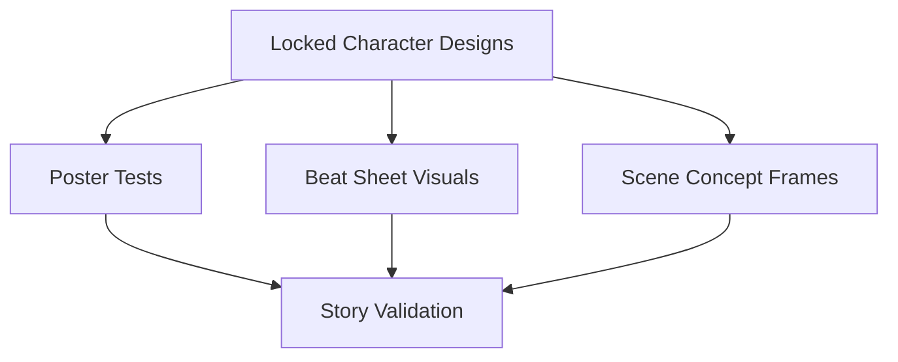

### Pass Progression

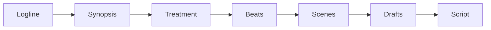

### Validation Loop

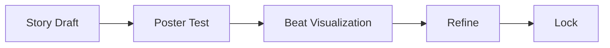

### Visuals

**Poster Tests**

| | | | | | | | |
|---|---|---|---|---|---|---|---|
| 

 | 

 | 

 | 

 | 

 | 

 | 

 | 

 |
| 
Historical
 | 
War
 | 
Sci-Fi
 | 
Family Fantasy
 | 
Epic Sci-Fi
 | 
Supernatural
 | 
Sci-Fi Drama
 |

<em>
These images are generated using structured prompts derived from narrative development passes, allowing rapid exploration of tone, genre, and visual identity across projects.
</em>

**Beat Sheet Visuals**

| Beat 1                            | Beat 2                         |
| --------------------------------- | ------------------------------ |
|  |  |

**Character Designs (Locked)**

| Character 1                        | Character 2                         |
| ---------------------------------- | ----------------------------------- |
|  |  |

**Animated Concept Scene (Grok)**
[▶ Watch Concept Scene Video](YOUTUBE_LINK_HERE)

### Key Insights

* Prevents narrative drift in long-form projects
* Uses visual validation to test tone early
* Maintains character consistency across all outputs

---

# Applied Systems

---

---

## Prism Vocabulary Engine + Narrative Integration

**Objective:**
Combine a database-driven vocabulary system with narrative development workflows.

### System Flow

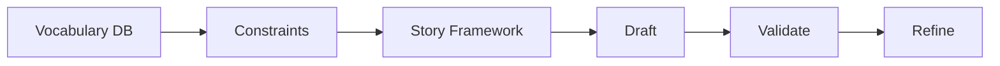

### Integration Loop

### Visuals

**Database Schema**

**Query Outputs / Word Tracking**

**Story + Vocabulary Alignment**

### Key Insights

* Data directly shapes creative output
* Enables scalable book production
* Demonstrates multi-system integration

---

## Cross-Platform Video Generation Pipeline

**Objective:**
Generate and refine video outputs using multiple AI platforms.

### Workflow

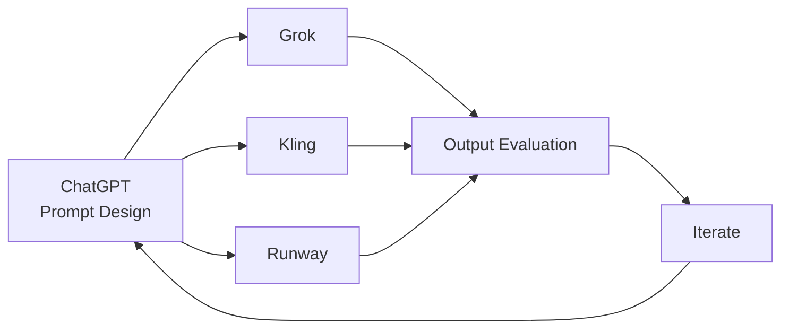

### Visuals

**Platform Comparison**

**Motion Frames**

**Prompt vs Output**

### Key Insights

* Each platform has different strengths
* Iteration is required for quality control

---

# Technical Systems

---

---

## ComfyUI Debugging & Optimization

**Objective:**
Stabilize and optimize complex AI pipelines under hardware constraints.

### Debug Flow

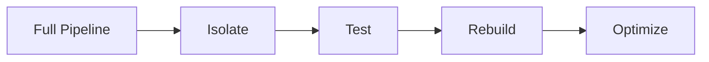

### Visuals

**Node Graph (Before / After)**

| Before                              | After                              |
| ----------------------------------- | ---------------------------------- |
|  |  |

**Error Debugging Example**

**Performance Comparison**

### Key Insights

* Debugging is essential for production readiness
* Hardware constraints shape workflow design

---

# Additional Systems

---

---

## Research → Product Framework

* Deep research → system design → prototype architecture

## STEAM PNKS Venture System

* Educational + community platform design

## Dynamic Keyboard Concept

* AI-assisted product ideation

## Forensic Analysis / Follow the Money

* Financial flow mapping
* Narrative deconstruction

---

# Meta System

---

---

## AI-Assisted Personal Coaching System

**Objective:**
Use ChatGPT as a continuous learning and execution engine.

### Learning Loop

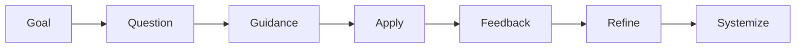

### Key Insights

* AI accelerates skill acquisition
* Learning is integrated directly into production workflows

---

# Workflow Design Principles

---

---

### Evaluation & Validation

* Outputs are tested across visual, narrative, and technical layers

### Modularity

* Workflows are reusable and portable across projects

### Human-in-the-Loop

* Critical decisions are guided, not automated

---

# Closing

These systems demonstrate a unified approach to AI:

> Not as isolated tools, but as structured, validated, and reusable workflow systems.

---

## Next Steps (Optional Enhancements)

* Add embedded videos (Grok / Kling outputs)
* Add interactive diagrams (Mermaid / images)
* Expand case studies with deeper breakdowns
