<!-- ===================================================== -->
<!-- README TITLE BANNER -->
<!-- Replace src if your final filename/path differs -->
<!-- ===================================================== -->

  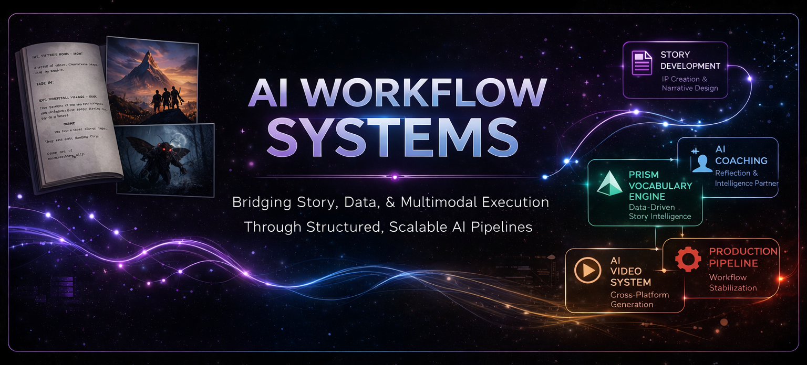

Structured systems for narrative, production, learning, and multimodal execution.

## Overview

This repository documents a collection of **AI-driven workflow systems** designed to bridge creative development, technical execution, and scalable system design.

These are not isolated experiments or outputs.  
They are **repeatable, modular systems** built to:

- develop narrative IP  
- generate and validate visual content  
- integrate across multiple AI platforms  
- enforce structure through data and constraints  
- scale from concept to production  

> This is not a portfolio of results — it is a portfolio of systems.

## Core Capabilities

- **Multimodal Systems** — text → image → video → VFX pipelines  
- **Narrative System Design** — structured story development and IP creation  
- **Data-Driven Content Pipelines** — constraints shaping creative output  
- **Cross-Platform AI Orchestration** — Grok, Kling, Runway, ComfyUI, WAN  
- **Workflow Engineering** — debugging, iteration, and system stabilization  
- **AI-Assisted System Design** — using AI as a thinking and execution partner  

---

<!-- ===================================================== -->
<!-- STORY DEVELOPMENT SYSTEM -->
<!-- ===================================================== -->
  

  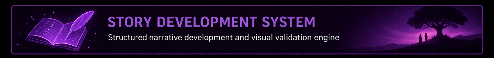

**Objective:**  
Develop narrative IP using a structured, repeatable AI-assisted framework that preserves story continuity while enabling deep visual and cinematic exploration.

Story development is treated as a **state-driven system**, not a linear writing process. Narrative progression, character design, visual diagnostics, beat validation, and motion testing operate as interconnected layers guiding projects from exploration to locked story decisions.

### Global System Overview

Global system architecture showing how narrative development, governance, visual generation, diagnostics, and deliverables interact inside a unified creative system.

### Core Narrative Engine

Projects progress through structured passes while transitioning between DRAFT, WORKING, and LOCKED states. Iteration, validation, and relocking are built into the system.

### Production Outputs

Locked narrative foundations generate structured outputs across creative development, production planning, and business-facing deliverables.

### Validation Engine

Narrative and visual inputs are continuously tested through diagnostics, including poster tests, beat sheets, scene builds, and motion validation.

### Visual Validation Workflows

### Character Identity → Motion Validation

<table>
<tr>
<th align="center" colspan="2">Locked Character Designs → Scene-Based Animation Tests</th>
</tr>
<tr>
<td align="center" bgcolor="#3f4a54">
 ▶ Watch Scene
</td>
<td align="center" bgcolor="#3f4a54">
 ▶ Watch Scene
</td>
</tr>
<tr>
<td align="center" bgcolor="#3f4a54">
 ▶ Watch Scene
</td>
<td align="center" bgcolor="#3f4a54">
 ▶ Watch Scene
</td>
</tr>
</table>

Character designs are locked as canonical assets and used to drive downstream visual generation. Scene-based animation tests validate performance, staging, and emotional tone before deeper production investment.

### Beat Sheet → Motion Validation

<table>
<tr>
<th align="center">Screenplay Context</th><th></th><th align="center" colspan="3">Visual Beat Sheets</th><th></th><th align="center">Motion Test</th>
</tr>
<tr>
<td align="center" bgcolor="#3f4a54"></td>
<td align="center"><h2>+</h2></td>
<td align="center" bgcolor="#3f4a54"></td>
<td align="center" bgcolor="#3f4a54"></td>
<td align="center" bgcolor="#3f4a54"></td>
<td align="center"><h2>➜</h2></td>
<td align="center" bgcolor="#3f4a54">
 ▶ Watch Scene
</td>
</tr>
</table>

Story structure is translated into visual beat sheets and tested in motion to evaluate pacing, clarity, and emotional impact before advancing.

<!-- STORY SYSTEM: CONCEPT TO INTERPRETATION TO MOTION -->

### Concept → Interpretation → Motion

<table>
<tr>
<th align="center" colspan="5">Concept + Context Inputs</th><th></th><th align="center" colspan="1">Scene Generation</th><th></th><th align="center" colspan="1">Motion Validation</th>
</tr>
<tr>
<th align="center">Screenplay Context</th><th></th><th align="center" colspan="3">Concept Art</th><th></th><th align="center">Scene Generation (ChatGPT)</th><th></th><th align="center">Grok Video Test</th>
</tr>
<tr>
<td align="center" valign="middle" bgcolor="#3f4a54" rowspan="5"></td>
<td align="center" width="60"><h2>+</h2></td>
<td align="center" bgcolor="#3f4a54"></td>
<td align="center" width="60"><h2>+</h2></td>
<td align="center" bgcolor="#3f4a54"></td>
<td align="center" width="60"><h2>➜</h2></td>
<td align="center" bgcolor="#3f4a54"></td>
<td align="center" width="60"><h2>➜</h2></td>
<td align="center" bgcolor="#3f4a54"> ▶ Watch Scene</td>
</tr>
<tr>
<td align="center" width="60"><h2>+</h2></td>
<td align="center" bgcolor="#3f4a54"></td>
<td align="center" width="60"><h2>+</h2></td>
<td align="center" bgcolor="#3f4a54"></td>
<td align="center" width="60"><h2>➜</h2></td>
<td align="center" bgcolor="#3f4a54"></td>
<td align="center" width="60"><h2>➜</h2></td>
<td align="center" bgcolor="#3f4a54"> ▶ Watch Scene</td>
</tr>
<tr>
<td align="center" width="60"><h2>+</h2></td>
<td align="center" bgcolor="#3f4a54"></td>
<td></td><td></td>
<td align="center" width="60"><h2>➜</h2></td>
<td align="center" bgcolor="#3f4a54"></td>
<td align="center" width="60"><h2>➜</h2></td>
<td align="center" bgcolor="#3f4a54"> ▶ Watch Scene</td>
</tr>
<tr>
<td align="center" width="60"><h2>+</h2></td>
<td align="center" bgcolor="#3f4a54"></td>
<td></td><td></td>
<td align="center" width="60"><h2>➜</h2></td>
<td align="center" bgcolor="#3f4a54"></td>
<td align="center" width="60"><h2>➜</h2></td>
<td align="center" bgcolor="#3f4a54"> ▶ Watch Scene</td>
</tr>
<tr>
<td align="center" width="60"><h2>+</h2></td>
<td align="center" bgcolor="#3f4a54"></td>
<td></td><td></td>
<td align="center" width="60"><h2>➜</h2></td>
<td align="center" bgcolor="#3f4a54"></td>
<td align="center" width="60"><h2>➜</h2></td>
<td align="center" bgcolor="#3f4a54"> ▶ Watch Scene</td>
</tr>
</table>

Scenes are generated by combining screenplay context with visual reference inputs, allowing ChatGPT to build narrative-consistent imagery rather than isolated prompts. These generated scenes are then tested in motion using Grok to validate composition, pacing, and tone—ensuring each moment holds up both visually and cinematically within the story.

### Poster Diagnostics

<table>
<tr>
<th align="center" colspan="8">Iterative Poster Diagnostics</th>
</tr>
<tr>
<td align="center" bgcolor="#3f4a54"></td>
<td align="center" bgcolor="#3f4a54"></td>
<td align="center" bgcolor="#3f4a54"></td>
<td align="center" bgcolor="#3f4a54"></td>
<td align="center" bgcolor="#3f4a54"></td>
<td align="center" bgcolor="#3f4a54"></td>
<td align="center" bgcolor="#3f4a54"></td>
<td align="center" bgcolor="#3f4a54"></td>
</tr>
<tr>
<td align="center">Historical</td>
<td align="center">War</td>
<td align="center">Sci-Fi</td>
<td align="center">Family Fantasy</td>
<td align="center">Epic Sci-Fi</td>
<td align="center">Supernatural</td>
<td align="center">Sci-Fi Drama</td>
<td align="center">Family Animation</td>
</tr>
</table>

Poster tests act as high-level diagnostics, providing a rapid read on tone, genre, character, and world. Early passes are exploratory; later iterations align with locked narrative decisions.

## Key Insights

- Prevents narrative drift in long-form development  
- Uses visual validation to test tone early  
- Maintains consistency across story, character, and output  
- Integrates narrative, visual, and motion systems into a unified workflow  

---

<!-- ===================================================== -->
<!-- PRISM SYSTEM -->
<!-- ===================================================== -->
  

  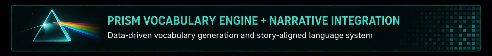

**Objective:**  
Combine a database-driven vocabulary system with narrative development workflows to create scalable, level-based books.

- **Academic alignment** to recognized reading-level standards  
- **Color-coded progression** for intuitive learner and instructor guidance  
- **Narrative continuity** through consistent characters, tone, and world-building  
- **Series scalability** with controlled increases in linguistic and narrative complexity  
- **Multimodal extensibility** through read-along and animated adaptations

## System Overview (Literacy + Narrative Architecture)

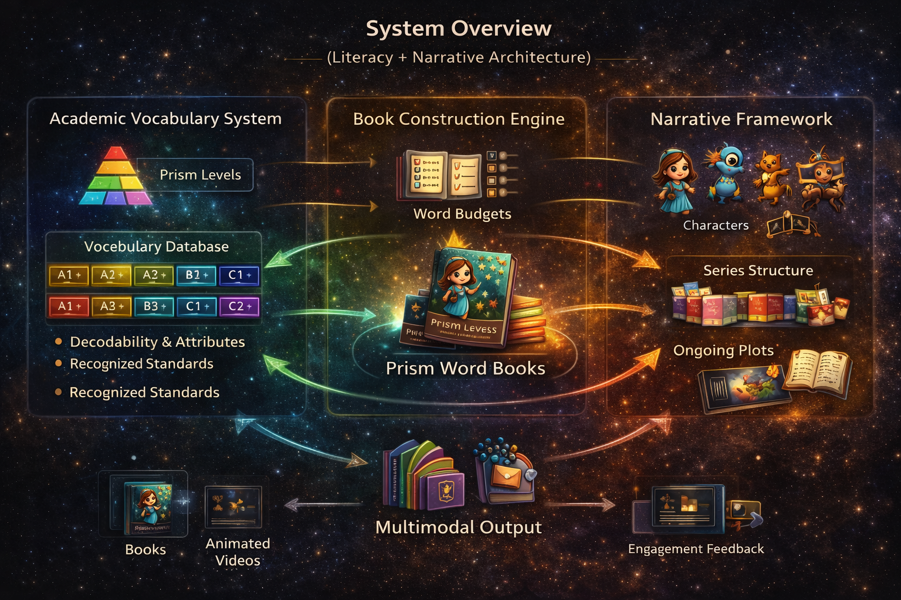

<!-- ===================================================== -->
<!-- PRISM: BACKEND SYSTEM (DATA + CONSTRAINT ENGINE) -->
<!-- ===================================================== -->

## Backend System (Data + Constraint Engine)

<table>
<tr>

<td align="center" bgcolor="#3f4a54">

 
<b>Vocabulary Database Schema</b>
</td>

<td align="center" bgcolor="#3f4a54">

 
<b>Constraint Query Outputs</b>
</td>

<td align="center" bgcolor="#3f4a54">

 
<b>Story + Vocabulary Alignment</b>
</td>

</tr>
</table>

A structured vocabulary database combined with constraint-driven queries actively shapes story construction. Reading-level targets, word exposure limits, and reinforcement patterns are enforced at the data layer rather than corrected after generation.

## Book Generation → Franchise Expansion

<table>
<tr>

<td align="center" width="45%" bgcolor="#3f4a54">
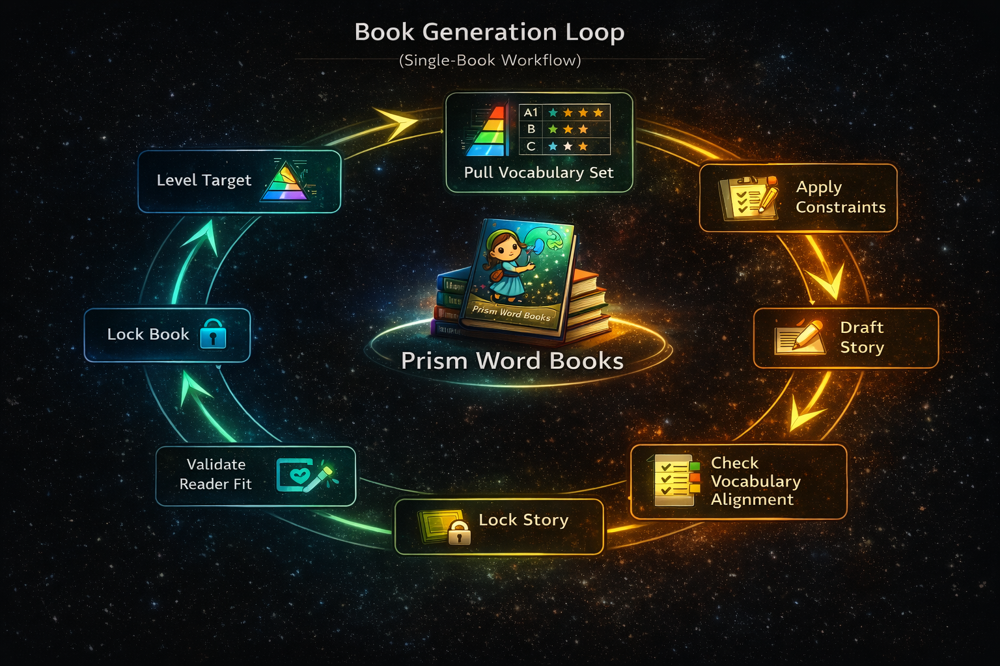
 
<b>Single-Book Workflow</b>
 

Vocabulary constraints guide drafting, validation, and refinement to ensure alignment with reading level and narrative intent.

</td>

<td align="center" width="10%">
<b>➜</b>
 
<b>Scale</b>
</td>

<td align="center" width="45%" bgcolor="#3f4a54">
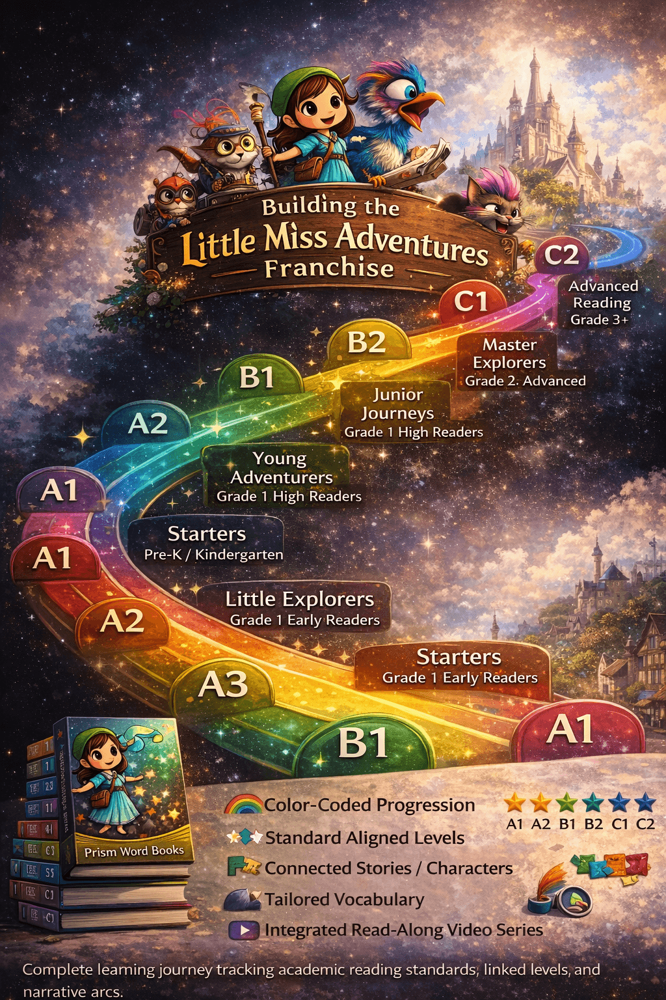
 
<b>Series / Franchise System</b>
 

Books expand into structured series aligned to academic levels, enabling scalable literacy progression and cohesive story worlds.

</td>

</tr>
</table>

The system evolves from constrained single-book generation into a scalable franchise architecture, where vocabulary progression, narrative continuity, and academic alignment operate across entire series and learning stages.

## Multimodal Expansion (Prism Cosmos)

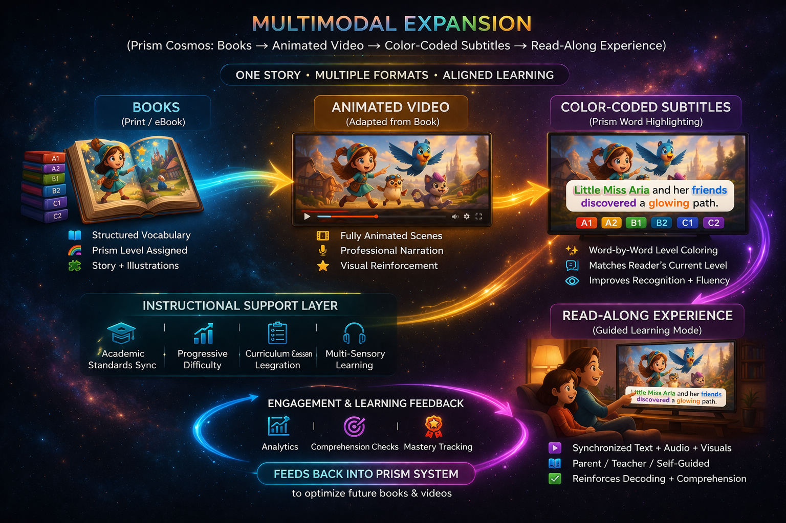

## Key Insights

- Vocabulary acts as a **primary design constraint**  
- Narrative and data systems are tightly coupled  
- The system scales from individual books to full series ecosystems  

---

<!-- ===================================================== -->
<!-- AI COACHING SYSTEM -->
<!-- ===================================================== -->

  

  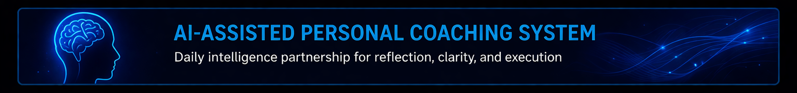

**Objective:**  
Use ChatGPT as a continuous learning, problem-solving, and execution engine across all workflows.

## System Overview

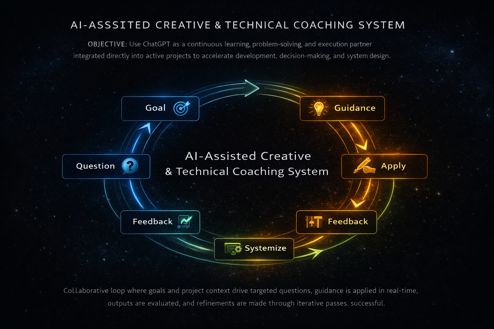

A continuous loop where goals, questions, execution, and feedback are iteratively refined and systematized. This system operates across all other workflows in the repository.

## How It Operates

- Defines goals and decomposes problems  
- Generates structured guidance and solutions  
- Applies solutions directly to production workflows  
- Evaluates outcomes and identifies gaps  
- Refines approaches and captures reusable patterns  

## Key Insights

- AI functions as a **thinking partner**, not just a tool  
- Learning is embedded directly into execution  
- Systems improve over time through structured iteration  

---

<!-- ===================================================== -->
<!-- CREATURE PIPELINE -->
<!-- ===================================================== -->

  

  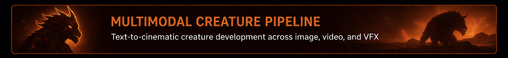

**Objective:**  
Create a consistent AI-generated character and integrate it into production-ready visual pipelines.

## System Overview

## Pipeline Breakdown (Stage Outputs)

<table>
<tr>
<th align="center">Concept</th>
<th align="center">Dataset</th>
<th align="center">Training</th>
<th align="center">LoRA Applications</th>
</tr>
<tr>

<td align="center" bgcolor="#3f4a54">

 Hero Design
</td>

<td align="center" bgcolor="#3f4a54">

 Pose Dataset
</td>

<td align="center" bgcolor="#3f4a54">

 LoRA Training
</td>

<td align="center" bgcolor="#3f4a54">

 

 

 

 Multi-Scene LoRA Tests ▶

</td>

</tr>
</table>

## Integration (Before → After)

<table>
<tr>
<th align="center" colspan="3">Live Action Integration</th>
</tr>
<tr>
<td align="center" bgcolor="#3f4a54">

 Plate
</td>

<td align="center" width="80">
<h2>➜</h2>
</td>

<td align="center" bgcolor="#3f4a54">

 Final Composite
</td>
</tr>
</table>

## Integration

- ControlNet for spatial consistency  
- Segmentation for compositing  
- LoRA for identity consistency across shots  

## Key Insights

- AI generation + traditional VFX enables production-quality output  
- Early validation reduces downstream failure  
- LoRA enables cross-shot character consistency  

---

<!-- ===================================================== -->
<!-- VIDEO SYSTEM -->
<!-- ===================================================== -->
  

  

**Objective:**  
Evaluate and orchestrate multiple AI video platforms to achieve controlled, production-aligned results.

## System Overview

*(Replace mermaid later with styled graphic if desired)*

## Platform Roles

- **Grok** — rapid motion ideation  
- **Kling** — structured video generation with references  
- **Runway** — stylized generation and compositing  

## Key Insights

- No single platform solves all problems  
- Workflow design determines output quality more than the model  
- Iterative testing is required for reliable results  

---

<!-- ===================================================== -->
<!-- APPLIED SYSTEM DESIGN -->
<!-- ===================================================== -->
  

  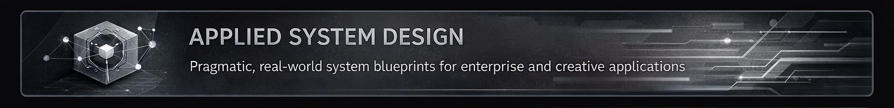

## Systems & Venture Concepts

- **STEAM PNKS** — education + maker ecosystem  
- **Research → Product Framework** — investigative system design  
- **Civic / Financial Analysis Systems** — structured data + narrative mapping  
- **Adaptive Input Systems** — dynamic keyboard / interface concepts  

---

<!-- ===================================================== -->
<!-- TECHNICAL SYSTEMS -->
<!-- ===================================================== -->
  

  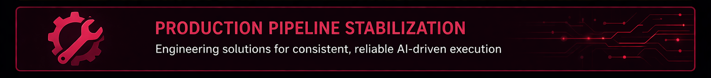

**Objective:**  
Ensure reliability and performance of AI-driven pipelines under real-world constraints.

## Focus Areas

- Debugging ComfyUI workflows  
- Managing GPU constraints  
- Resolving model compatibility issues  
- Optimizing runtime performance  

## Key Insights

- Stability is as critical as capability  
- AI workflows require engineering discipline  
- Debugging is a core competency, not a side task  

---

<!-- ===================================================== -->
<!-- ENTERPRISE SYSTEM (OPTIONAL BUT RECOMMENDED) -->
<!-- ===================================================== -->
  

  

**Objective:**  
Apply AI workflow principles to structured decision-making systems (finance, policy, or analytics).

## System Overview

*(Add graphic later if you proceed)*

## Key Idea

Map data, events, and relationships into structured narratives that support decision-making and analysis.

---

<!-- ===================================================== -->
<!-- PRINCIPLES -->
<!-- ===================================================== -->

  

  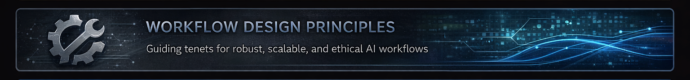

- **Evaluation & Validation** — every stage must be testable  
- **Modularity** — systems must be recomposable  
- **Human-in-the-Loop** — creative control remains central  
- **Iterative State Control** — workflows evolve through managed state transitions  

---

  

## Closing

AI is not a toolset — it is a **system design problem**.

The workflows in this repository demonstrate how structured thinking, iterative processes, and cross-platform integration can transform AI from experimentation into production-ready systems.

---
