<!-- ===================================================== -->
<!-- README TITLE BANNER -->
<!-- Replace src if your final filename/path differs -->
<!-- ===================================================== -->

<p align="center">
  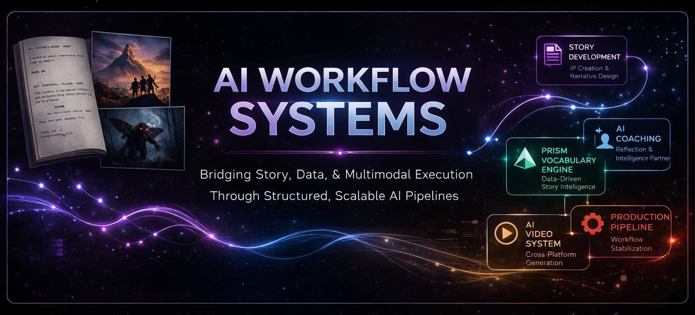
</p>

<p align="center"><sub>
Structured AI systems for narrative, production, learning, and multimodal execution.
</sub></p>

## Overview

This repository documents a collection of **AI-driven workflow systems** designed to bridge creative development, technical execution, and scalable system design.

These are not isolated experiments or outputs.  
They are **repeatable, modular systems** built to:

- develop narrative IP  
- generate and validate visual content  
- integrate across multiple AI platforms  
- enforce structure through data and constraints  
- scale from concept to production  

> This is not a portfolio of results — it is a portfolio of systems.

## Core Capabilities

- **Multimodal Systems** — text → image → video → VFX pipelines  
- **Narrative System Design** — structured story development and IP creation  
- **Data-Driven Content Pipelines** — constraints shaping creative output  
- **Cross-Platform AI Orchestration** — Grok, Kling, Runway, ComfyUI, WAN  
- **Workflow Engineering** — debugging, iteration, and system stabilization  
- **AI-Assisted System Design** — using AI as a thinking and execution partner  

---

<!-- ===================================================== -->
<!-- STORY DEVELOPMENT SYSTEM -->
<!-- ===================================================== -->
<br></br>


<p align="center">
  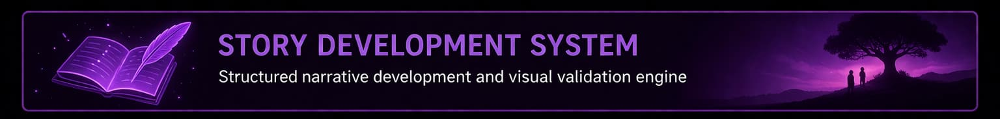
</p>

**Objective:**  
Develop narrative IP using a structured, repeatable AI-assisted framework that preserves story continuity while enabling deep visual and cinematic exploration.

Story development is treated as a **state-driven system**, not a linear writing process. Narrative progression, character design, visual diagnostics, beat validation, and motion testing operate as interconnected layers guiding projects from exploration to locked story decisions.

### Global System Overview


<p align="center"><sub>
Global system architecture showing how narrative development, governance, visual generation, diagnostics, and deliverables interact inside a unified creative system.
</sub></p>

### Core Narrative Engine


<p align="center"><sub>
Projects progress through structured passes while transitioning between DRAFT, WORKING, and LOCKED states. Iteration, validation, and relocking are built into the system.
</sub></p>

### Production Outputs


<p align="center"><sub>
Locked narrative foundations generate structured outputs across creative development, production planning, and business-facing deliverables.
</sub></p>

### Validation Engine

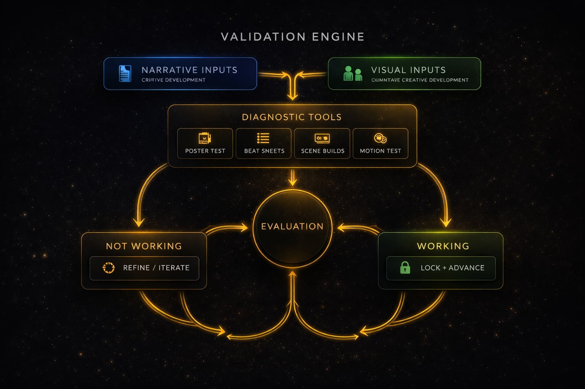

<p align="center"><sub>
Narrative and visual inputs are continuously tested through diagnostics, including poster tests, beat sheets, scene builds, and motion validation.
</sub></p>

### Visual Validation Workflows

### Character Identity → Motion Validation

<table>
<tr>
<th align="center" colspan="2">Locked Character Designs → Scene-Based Animation Tests</th>
</tr>
<tr>
<td align="center" bgcolor="#3f4a54">
<a href="https://youtu.be/Po3QKtgxgQA" target="_blank">

</a><br/><sub>▶ Watch Scene</sub>
</td>
<td align="center" bgcolor="#3f4a54">
<a href="https://youtu.be/gJSSF3xBhgA" target="_blank">

</a><br/><sub>▶ Watch Scene</sub>
</td>
</tr>
<tr>
<td align="center" bgcolor="#3f4a54">
<a href="https://youtu.be/OYw3xDqHl_c" target="_blank">

</a><br/><sub>▶ Watch Scene</sub>
</td>
<td align="center" bgcolor="#3f4a54">
<a href="https://youtu.be/WdhYYRJrs6o" target="_blank">

</a><br/><sub>▶ Watch Scene</sub>
</td>
</tr>
</table>

<p align="center"><sub>
Character designs are locked as canonical assets and used to drive downstream visual generation. Scene-based animation tests validate performance, staging, and emotional tone before deeper production investment.
</sub></p>

### Beat Sheet → Motion Validation

<table>
<tr>
<th align="center">Screenplay Context</th><th></th><th align="center" colspan="3">Visual Beat Sheets</th><th></th><th align="center">Motion Test</th>
</tr>
<tr>
<td align="center" bgcolor="#3f4a54"></td>
<td align="center"><h2>+</h2></td>
<td align="center" bgcolor="#3f4a54"></td>
<td align="center" bgcolor="#3f4a54"></td>
<td align="center" bgcolor="#3f4a54"></td>
<td align="center"><h2>➜</h2></td>
<td align="center" bgcolor="#3f4a54">
<a href="https://youtube.com/shorts/KftJ5Cr9nzs">

</a><br/><sub>▶ Watch Scene</sub>
</td>
</tr>
</table>

<p align="center"><sub>
Story structure is translated into visual beat sheets and tested in motion to evaluate pacing, clarity, and emotional impact before advancing.
</sub></p>

<!-- STORY SYSTEM: CONCEPT TO INTERPRETATION TO MOTION -->

### Concept → Interpretation → Motion

<table>
<tr>
<th align="center" colspan="5">Concept + Context Inputs</th><th></th><th align="center" colspan="1">Scene Generation</th><th></th><th align="center" colspan="1">Motion Validation</th>
</tr>
<tr>
<th align="center">Screenplay Context</th><th></th><th align="center" colspan="3">Concept Art</th><th></th><th align="center">Scene Generation (ChatGPT)</th><th></th><th align="center">Grok Video Test</th>
</tr>
<tr>
<td align="center" valign="middle" bgcolor="#3f4a54" rowspan="5"></td>
<td align="center" width="60"><h2>+</h2></td>
<td align="center" bgcolor="#3f4a54"></td>
<td align="center" width="60"><h2>+</h2></td>
<td align="center" bgcolor="#3f4a54"></td>
<td align="center" width="60"><h2>➜</h2></td>
<td align="center" bgcolor="#3f4a54">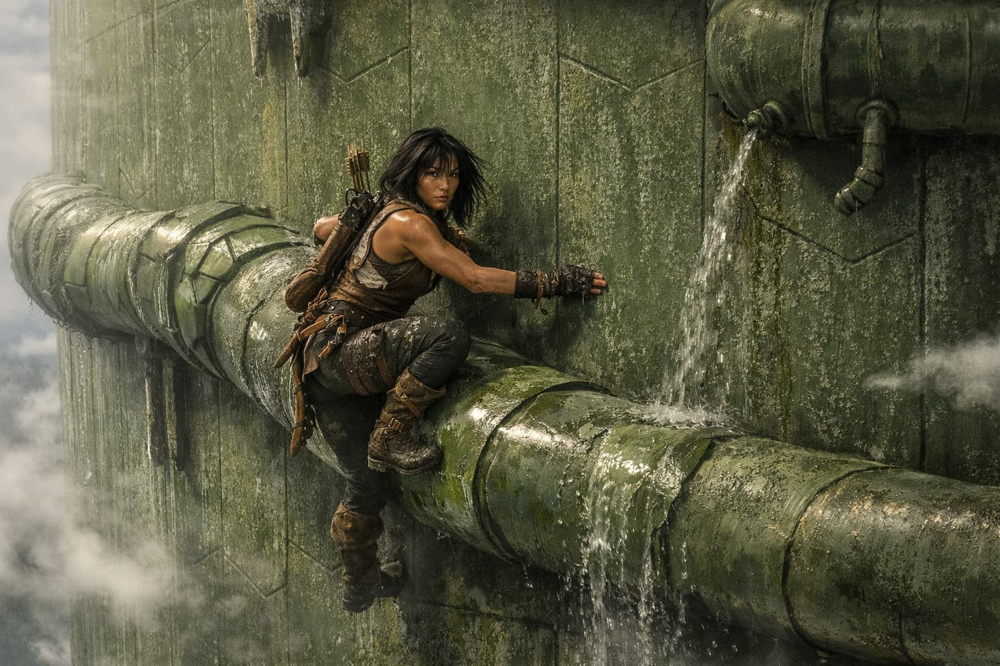</td>
<td align="center" width="60"><h2>➜</h2></td>
<td align="center" bgcolor="#3f4a54"><a href="https://youtu.be/JDSFaF0avvw"></a><br/><sub>▶ Watch Scene</sub></td>
</tr>
<tr>
<td align="center" width="60"><h2>+</h2></td>
<td align="center" bgcolor="#3f4a54"></td>
<td align="center" width="60"><h2>+</h2></td>
<td align="center" bgcolor="#3f4a54"></td>
<td align="center" width="60"><h2>➜</h2></td>
<td align="center" bgcolor="#3f4a54"></td>
<td align="center" width="60"><h2>➜</h2></td>
<td align="center" bgcolor="#3f4a54"><a href="https://youtu.be/TP7VpFD6Qbw">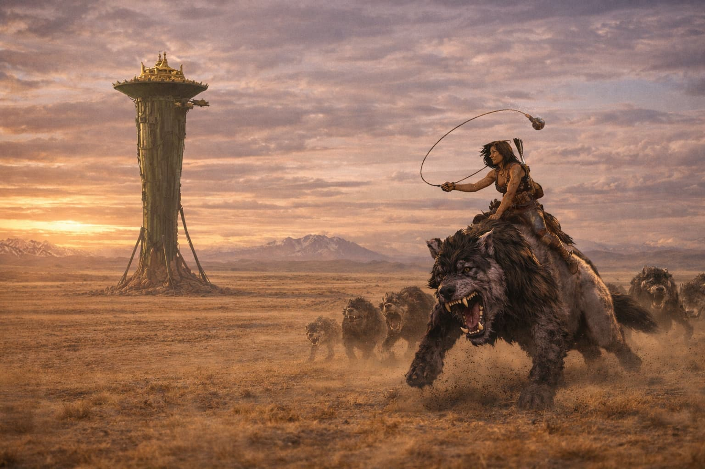</a><br/><sub>▶ Watch Scene</sub></td>
</tr>
<tr>
<td align="center" width="60"><h2>+</h2></td>
<td align="center" bgcolor="#3f4a54">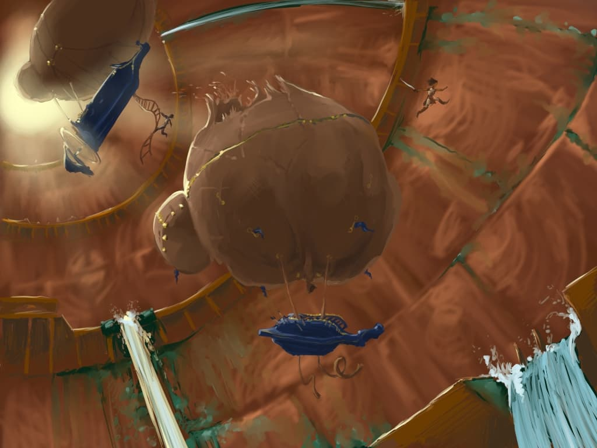</td>
<td></td><td></td>
<td align="center" width="60"><h2>➜</h2></td>
<td align="center" bgcolor="#3f4a54"></td>
<td align="center" width="60"><h2>➜</h2></td>
<td align="center" bgcolor="#3f4a54"><a href="https://youtu.be/EaPQb0pcfFs"></a><br/><sub>▶ Watch Scene</sub></td>
</tr>
<tr>
<td align="center" width="60"><h2>+</h2></td>
<td align="center" bgcolor="#3f4a54"></td>
<td></td><td></td>
<td align="center" width="60"><h2>➜</h2></td>
<td align="center" bgcolor="#3f4a54"></td>
<td align="center" width="60"><h2>➜</h2></td>
<td align="center" bgcolor="#3f4a54"><a href="https://youtu.be/Bn5TgId9vwU"></a><br/><sub>▶ Watch Scene</sub></td>
</tr>
<tr>
<td align="center" width="60"><h2>+</h2></td>
<td align="center" bgcolor="#3f4a54"></td>
<td></td><td></td>
<td align="center" width="60"><h2>➜</h2></td>
<td align="center" bgcolor="#3f4a54">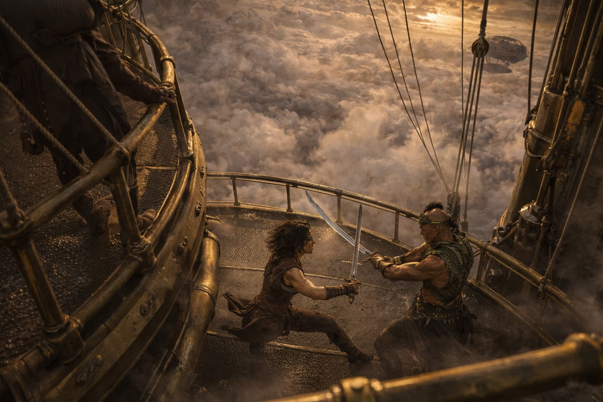</td>
<td align="center" width="60"><h2>➜</h2></td>
<td align="center" bgcolor="#3f4a54"><a href="https://youtu.be/dGcI82PfSBE"></a><br/><sub>▶ Watch Scene</sub></td>
</tr>
</table>

<p align="center"><sub>
Scenes are generated by combining screenplay context with visual reference inputs, allowing ChatGPT to build narrative-consistent imagery rather than isolated prompts. These generated scenes are then tested in motion using Grok to validate composition, pacing, and tone—ensuring each moment holds up both visually and cinematically within the story.
</sub></p>

### Poster Diagnostics

<div align="center">

<table>
<tr>
<th align="center" colspan="8">Iterative Poster Diagnostics</th>
</tr>
<tr>
<td align="center" bgcolor="#3f4a54"></td>
<td align="center" bgcolor="#3f4a54"></td>
<td align="center" bgcolor="#3f4a54"></td>
<td align="center" bgcolor="#3f4a54"></td>
<td align="center" bgcolor="#3f4a54"></td>
<td align="center" bgcolor="#3f4a54"></td>
<td align="center" bgcolor="#3f4a54"></td>
<td align="center" bgcolor="#3f4a54"></td>
</tr>
<tr>
<td align="center"><sub>Historical</sub></td>
<td align="center"><sub>War</sub></td>
<td align="center"><sub>Sci-Fi</sub></td>
<td align="center"><sub>Family Fantasy</sub></td>
<td align="center"><sub>Epic Sci-Fi</sub></td>
<td align="center"><sub>Supernatural</sub></td>
<td align="center"><sub>Sci-Fi Drama</sub></td>
<td align="center"><sub>Family Animation</sub></td>
</tr>
</table>

</div>

<p align="center"><sub>
Poster tests act as high-level diagnostics, providing a rapid read on tone, genre, character, and world. Early passes are exploratory; later iterations align with locked narrative decisions.
</sub></p>

## Key Insights

- Prevents narrative drift in long-form development  
- Uses visual validation to test tone early  
- Maintains consistency across story, character, and output  
- Integrates narrative, visual, and motion systems into a unified workflow  

---

<!-- ===================================================== -->
<!-- PRISM SYSTEM -->
<!-- ===================================================== -->
<br></br>


<p align="center">
  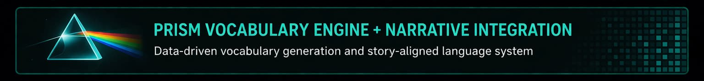
</p>

**Objective:**  
Combine a database-driven vocabulary system with narrative development workflows to create scalable, level-based books.

- **Academic alignment** to recognized reading-level standards  
- **Color-coded progression** for intuitive learner and instructor guidance  
- **Narrative continuity** through consistent characters, tone, and world-building  
- **Series scalability** with controlled increases in linguistic and narrative complexity  
- **Multimodal extensibility** through read-along and animated adaptations

## System Overview (Literacy + Narrative Architecture)


<!-- ===================================================== -->
<!-- PRISM: BACKEND SYSTEM (DATA + CONSTRAINT ENGINE) -->
<!-- ===================================================== -->

## Backend System (Data + Constraint Engine)

<table>
<tr>

<td align="center" bgcolor="#3f4a54">

<br/>
<sub><b>Vocabulary Database Schema</b></sub>
</td>

<td align="center" bgcolor="#3f4a54">

<br/>
<sub><b>Constraint Query Outputs</b></sub>
</td>

<td align="center" bgcolor="#3f4a54">

<br/>
<sub><b>Story + Vocabulary Alignment</b></sub>
</td>

</tr>
</table>

<p align="center"><sub>
A structured vocabulary database combined with constraint-driven queries actively shapes story construction. Reading-level targets, word exposure limits, and reinforcement patterns are enforced at the data layer rather than corrected after generation.
</sub></p>

## Book Generation → Franchise Expansion

<table>
<tr>

<td align="center" width="45%" bgcolor="#3f4a54">

<br/>
<sub><b>Single-Book Workflow</b></sub>
<br/>
<sub>
Vocabulary constraints guide drafting, validation, and refinement to ensure alignment with reading level and narrative intent.
</sub>
</td>

<td align="center" width="10%">
<span style="font-size:48px;"><b>➜</b></span>
<br/>
<sub><b>Scale</b></sub>
</td>

<td align="center" width="45%" bgcolor="#3f4a54">

<br/>
<sub><b>Series / Franchise System</b></sub>
<br/>
<sub>
Books expand into structured series aligned to academic levels, enabling scalable literacy progression and cohesive story worlds.
</sub>
</td>

</tr>
</table>

<p align="center"><sub>
The system evolves from constrained single-book generation into a scalable franchise architecture, where vocabulary progression, narrative continuity, and academic alignment operate across entire series and learning stages.
</sub></p>

## Multimodal Expansion (Prism Cosmos)


## Key Insights

- Vocabulary acts as a **primary design constraint**  
- Narrative and data systems are tightly coupled  
- The system scales from individual books to full series ecosystems  

---

<!-- ===================================================== -->
<!-- AI COACHING SYSTEM -->
<!-- ===================================================== -->

<br></br>

<p align="center">
  
</p>

**Objective:**  
Use ChatGPT as a continuous learning, problem-solving, and execution engine across all workflows.

## System Overview


<p align="center"><sub>
A continuous loop where goals, questions, execution, and feedback are iteratively refined and systematized. This system operates across all other workflows in the repository.
</sub></p>

## How It Operates

- Defines goals and decomposes problems  
- Generates structured guidance and solutions  
- Applies solutions directly to production workflows  
- Evaluates outcomes and identifies gaps  
- Refines approaches and captures reusable patterns  

## Key Insights

- AI functions as a **thinking partner**, not just a tool  
- Learning is embedded directly into execution  
- Systems improve over time through structured iteration  

---

<!-- ===================================================== -->
<!-- CREATURE PIPELINE -->
<!-- ===================================================== -->

<br></br>

<p align="center">
  
</p>

**Objective:**  
Create a consistent AI-generated character and integrate it into production-ready visual pipelines.

## System Overview


## Pipeline Breakdown (Stage Outputs)

<table>
<tr>
<th align="center">Concept</th>
<th align="center">Dataset</th>
<th align="center">Training</th>
<th align="center">LoRA Applications</th>
</tr>
<tr>

<td align="center" bgcolor="#3f4a54">

<br/><sub>Hero Design</sub>
</td>

<td align="center" bgcolor="#3f4a54">

<br/><sub>Pose Dataset</sub>
</td>

<td align="center" bgcolor="#3f4a54">

<br/><sub>LoRA Training</sub>
</td>

<td align="center" bgcolor="#3f4a54">

<a href="https://youtu.be/T57d_ERXKjU" target="_blank">

</a><br/>

<a href="https://youtu.be/D1O6J3-mofQ" target="_blank">

</a><br/>

<a href="https://youtu.be/jxlbnHHw_D4" target="_blank">

</a><br/>

<br/><sub>Multi-Scene LoRA Tests ▶</sub>

</td>

</tr>
</table>

## Integration (Before → After)

<table>
<tr>
<th align="center" colspan="3">Live Action Integration</th>
</tr>
<tr>
<td align="center" bgcolor="#3f4a54">

<br/><sub>Plate</sub>
</td>

<td align="center" width="80">
<h2>➜</h2>
</td>

<td align="center" bgcolor="#3f4a54">

<br/><sub>Final Composite</sub>
</td>
</tr>
</table>

## Integration

- ControlNet for spatial consistency  
- Segmentation for compositing  
- LoRA for identity consistency across shots  

## Key Insights

- AI generation + traditional VFX enables production-quality output  
- Early validation reduces downstream failure  
- LoRA enables cross-shot character consistency  

---
<!-- ===================================================== -->
<!-- VIDEO SYSTEM -->
<!-- ===================================================== -->

<br/>

<p align="center">
  
</p>

**Objective:**  
Design a deliverable-driven AI video workflow that balances quality, control, cost, and iteration speed across closed and open systems.

## System Overview

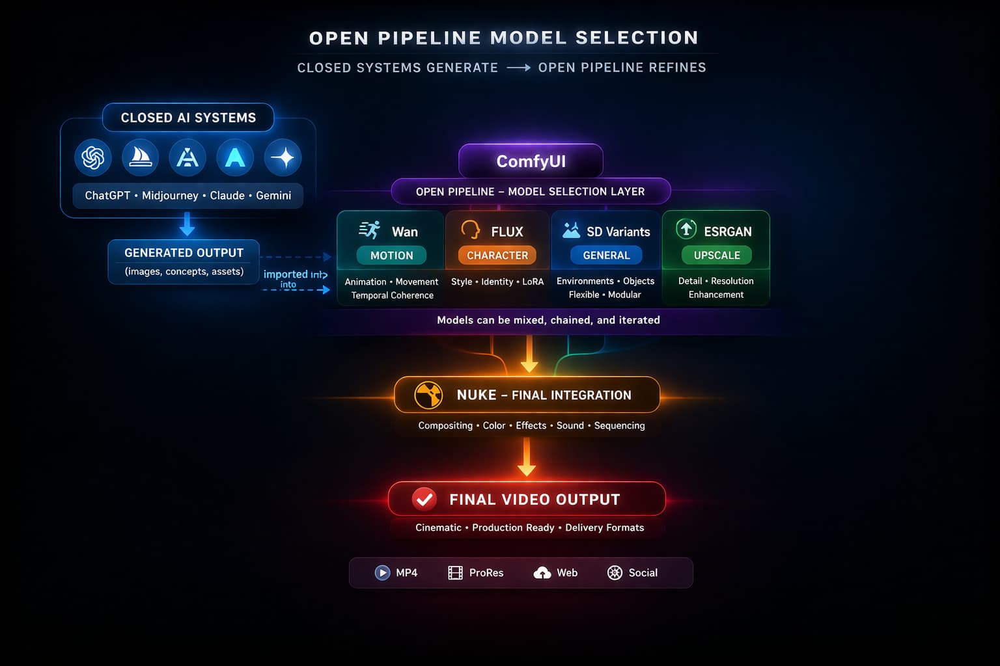

<p align="center"><sub>
A spec-driven video workflow where project requirements govern platform selection, iteration strategy, and finishing decisions. Closed systems are used for exploration and element generation, while open pipeline tools enforce consistency, upscaling, integration, and final delivery.
</sub></p>

## Deliverable-Driven Strategy

All major decisions in this system are anchored to **final delivery requirements**, not intermediate experiments.

Project specs define:

- Resolution
- Frame rate
- Shot length and continuity
- Visual quality targets
- Sequence consistency
- Client / production constraints

### Working vs Final States

**Exploration Phase**
- Lower resolution
- Shorter clips
- Faster iteration
- Looser quality thresholds

**Delivery Phase**
- Full resolution
- Show-spec formatting
- Cross-shot consistency
- Production-quality integration

## Strategic Principle

> Early experiments are only useful if they preserve a path to final delivery.

## Pipeline Ingest & Spec Definition

Before generation begins, the workflow is framed by a pipeline-based approach that defines the shot, sequence, and delivery context.

## Core Control Layer

- **Nuke**
  - plate ingest
  - color pipeline awareness
  - shot/sequence integration
  - final compositing and delivery control

- **ComfyUI**
  - controlled image/video iteration
  - conditioning workflows
  - repeatable upscaling / enhancement paths
  - structured generation outside closed-box systems

This keeps the overall workflow grounded in a **pipeline paradigm from input to output**, rather than letting closed vendors define the process.

> AI vendors generate elements. The pipeline defines the shot.
> 
## System Flow

<div align="center">
  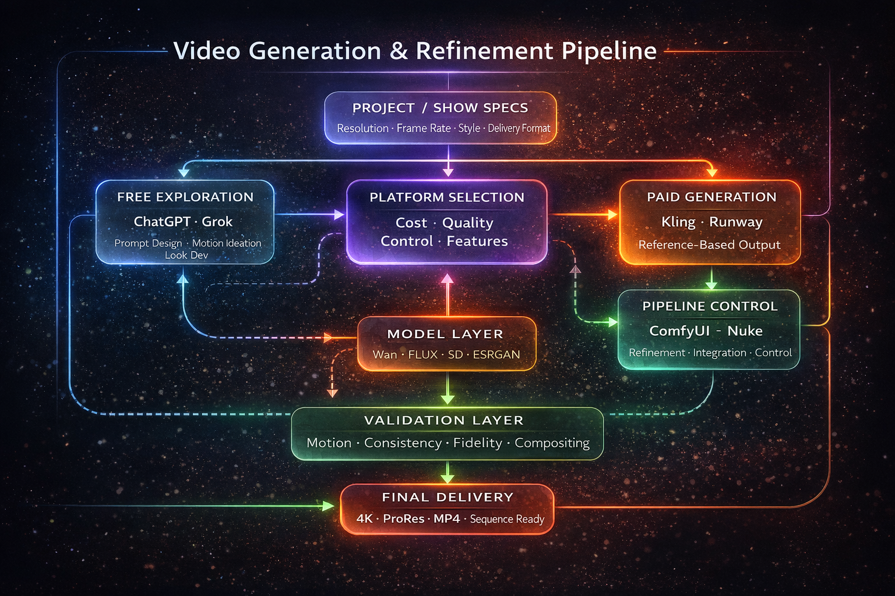
</div>

<p align="center"><sub>
Model selection is task-driven, balancing quality, control, stability, and performance within a flexible open pipeline.
</sub></p>

<!-- ===================================================== -->
<!-- VIDEO SYSTEM: STRATEGY + PIPELINE LOGIC -->
<!-- ===================================================== -->

## Cost-Aware Iteration Strategy

Most closed AI video systems operate under **credit-based paywalls**, making iteration expensive even though iteration is essential for achieving quality results.

This system resolves that tension by separating **exploration** from **execution**.

---

### Free Exploration

Use **ChatGPT** and **Grok** for:

- prompt design  
- motion ideation  
- look development  
- reference strategy  
- rapid testing  

---

### Paid Execution

Use credit-based systems such as:

- **Kling**  
- **Runway**  
- **Veo / Sora** *(where applicable)*  

Only after:

- intent is clarified  
- prompts are refined  
- references are selected  
- platform choice is justified  

> Iterate freely where cost is zero. Execute precisely where cost is high.

---

## Platform Evaluation Criteria

Each platform is evaluated against production-critical factors:

---

### Resolution
- output size  
- scalability to final spec  

### Clip Length
- maximum generation duration  
- usefulness for real shot design  

### Model Quality
- photorealism  
- camera realism  
- cinematic fidelity  
- controllability  

### Feature Set
- inpainting / masking  
- tracking / motion control  
- transformation / effects  
- compositing-adjacent tools  

### Usability
- GUI / workflow speed  
- iteration efficiency  
- render times  

### Privacy
- suitability for proprietary or sensitive work  

### Repeatability
- consistency across generations  
- ability to maintain look across shots  

---

Platform selection is based on these constraints, not convenience.

---

## Platform Roles

- **ChatGPT** — prompt strategy, scene planning, reference design, iteration planning  
- **Grok** — free motion ideation and early exploratory testing  
- **Kling** — structured reference-driven video generation  
- **Runway** — stylized generation, transformations, and compositing-adjacent workflows  
- **ComfyUI** — controlled iteration, conditioning, enhancement, and upscaling  
- **Nuke** — ingest, integration, shot finishing, and delivery control  

---

## Open Pipeline Integration (ComfyUI + Nuke)

Closed AI platforms provide powerful generation capabilities, but operate as **black-box systems** with limited production control.

Open tools restore that control and enable integration into real production workflows.

<div align="center">
  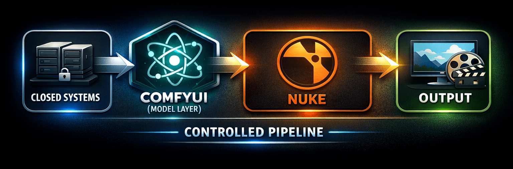
</div>

<p align="center"><sub>
Closed systems generate initial assets, while the open pipeline enables model flexibility, refinement, and production-level control before final delivery.
</sub></p>

### ComfyUI

- node-based workflow control  
- repeatable pipelines  
- conditioning / LoRA / enhancement workflows  
- deliberate upscaling strategies  

---

### Nuke

- final compositing  
- plate integration  
- cleanup and artifact removal  
- show-spec output control  
- consistency across shots and sequences  

## Upscaling & Finalization Strategy

Most GenAI image and video models are trained at resolutions below final delivery requirements.

Upscaling is therefore not an afterthought — it is a **planned stage of the pipeline**.

## Approach

- generate efficiently at lower cost during exploration  
- avoid wasting paid credits on high-resolution trial-and-error  
- transition into **ComfyUI / Nuke** for:
  - upscaling  
  - enhancement  
  - consistency  
  - final shot readiness  

> Generate efficiently. Upscale deliberately. Deliver to spec.

## Open Model Evaluation (ComfyUI / Nuke)

Within the open pipeline, **model selection is a primary control point**.

Unlike closed systems, ComfyUI workflows provide access to multiple models, each suited to specific tasks, constraints, and performance requirements.

## Model Selection Strategy

Models are selected based on:

- task type (generation, motion, enhancement, stylization)  
- required level of control  
- cross-shot consistency requirements  
- compatibility with conditioning (depth, pose, segmentation)  
- performance constraints (VRAM, speed, stability)  

## Representative Models

#### Wan (Video / Motion Models)
- strong temporal coherence  
- suited for motion continuity  
- higher computational cost  
- requires tuning for stability  

**Best used for:**
- controlled motion sequences  
- iterative animation workflows  

---

#### FLUX (Image Generation / LoRA Workflows)
- strong stylistic control  
- effective LoRA integration  
- flexible for dataset-driven workflows  

**Best used for:**
- character consistency  
- controlled image generation  
- dataset creation for downstream video  

---

#### Stable Diffusion Variants (General Purpose)
- widely supported  
- modular and flexible  
- broad ComfyUI compatibility  

**Best used for:**
- general generation  
- rapid prototyping  
- conditioning-based workflows  

---

#### Upscaling / Enhancement Models
- ESRGAN / Real-ESRGAN  
- latent upscalers  
- detail refinement networks  

**Best used for:**
- resolution scaling  
- detail recovery  
- final output preparation  

## Evaluation Dimensions

Each model is evaluated across:

- **Quality**
  - detail fidelity  
  - realism / stylization  

- **Control**
  - conditioning compatibility  
  - reproducibility  

- **Stability**
  - consistency across iterations  
  - failure behavior  

- **Performance**
  - VRAM requirements  
  - render speed  

## System Principle

> Models are interchangeable components within a controlled pipeline.

This allows the system to adapt to:

- project-specific requirements  
- evolving model capabilities  
- hardware constraints  

while maintaining a consistent workflow.

## Emerging / Extended Pipeline Layer

**NVIDIA Omniverse** is an increasingly important adjacent platform in this space.

While not currently a primary tool in this workflow, it represents a significant extension path for:

- USD-based pipelines  
- real-time production environments  
- simulation-heavy workflows  
- large-scale collaborative scene systems  

At present, Omniverse is best positioned as an **emerging extended pipeline layer**, not as a replacement for ComfyUI or Nuke.

## Key Insights

- AI video workflows must be driven by final deliverable requirements  
- Separating exploration from execution reduces cost and risk  
- Platform selection must be based on constraints, not preference  
- Closed systems generate; open systems provide control and finishing  
- Upscaling and spec compliance require dedicated strategy  
- Reliable results emerge from orchestration, not individual tools  

Closed Systems → Generate  
Open Systems   → Control, Refine, Integrate, Deliver  

---

## From Workflows to Systems

The following systems demonstrate how the same underlying architecture extends beyond workflows into real-world applications.

## AI System Architectures Across Domains

The same system architecture can be applied across fundamentally different domains—data analysis, investigative intelligence, human development, and digital economies.

These systems demonstrate how AI can be used to structure complexity into analyzable, actionable frameworks.

---

## Core System Pattern

```text
Data → Entities → Time → Relationships → Narrative → Visualization → Insight
```

This pattern is domain-independent and underpins every system presented below.

---

# Enterprise Systems

## CivicLedger — Analytical System

A source-linked, time-aware financial disclosure exploration system.

* Structures fragmented financial data into unified timelines
* Maps relationships between individuals, assets, and events
* Enables analysis through temporal alignment rather than isolated records
* Maintains strict provenance and source transparency

**System Role:**
Data → Transparency → Insight

---

## Forensic Crawler Platform — Investigative System

A provenance-first investigative reconstruction system built on verified, rights-aware data ingestion.

* Crawls trusted sources with licensing-aware classification
* Maintains immutable provenance records for all assets
* Structures multimedia into time-synced datasets
* Reconstructs events using AI-driven spatial and temporal modeling
* Explicitly distinguishes verified vs inferred content

**System Role:**
Evidence → Reconstruction → Truth Modeling

---

# Venture Systems

## STEAM PNKS — Human Development System

A structured learning and identity system built around creation, progression, and community.

* Maps individuals (PNKs) as evolving entities
* Tracks skills, projects, and achievements over time
* Structures relationships between people, work, and learning paths
* Transforms activity into narrative (growth, mastery, identity)
* Emphasizes real-world creation over abstract instruction

**System Role:**
Activity → Progression → Identity

---

## Perpetuity AI — Economic / Infrastructure System

A system for transforming human performance and identity into reusable, licensable digital assets.

* Captures human likeness and performance via volumetric systems
* Structures identity as a persistent, reusable dataset
* Enables deployment across media production pipelines
* Supports licensing, reuse, and monetization of digital identities
* Shifts production from one-time capture to asset-based infrastructure

**System Role:**
Identity → Asset → Infrastructure

---

# System Synthesis

Across all systems:

* Data is structured into entities
* Entities are anchored in time
* Relationships are made explicit
* Narrative emerges from structured context
* Visualization enables interpretation
* Insight becomes actionable

> The architecture remains constant.
> The domain changes.

---

<!-- ===================================================== -->
<!-- TECHNICAL SYSTEMS -->
<!-- ===================================================== -->
<br></br>


<p align="center">
  
</p>

**Objective:**  
Ensure reliability and performance of AI-driven pipelines under real-world constraints.

## Focus Areas

- Debugging ComfyUI workflows  
- Managing GPU constraints  
- Resolving model compatibility issues  
- Optimizing runtime performance  

## Key Insights

- Stability is as critical as capability  
- AI workflows require engineering discipline  
- Debugging is a core competency, not a side task  

---

## Core Workflow

```text
Data Sources (structured + unstructured)
        ↓
Ingestion + Normalization
        ↓
Entity Mapping (people, organizations, assets)
        ↓
Temporal Layer (time-bound events + states)
        ↓
Relationship Graph Construction
        ↓
Narrative Generation (AI-assisted interpretation)
        ↓
Visualization Layer (timelines, overlays, connections)
        ↓
Insight / Decision Support Output
```

---

<!-- ===================================================== -->
<!-- AI PRESENTATION ARCHITECTURE WORKFLOW -->
<!-- ===================================================== -->

## AI Presentation Architecture Workflow

**Objective:**  
Design structured, system-driven presentations using AI-assisted iteration, integrated visuals, and narrative cohesion.

---

## System Overview

This workflow replaces traditional slide-based thinking with a **system-first approach to presentation design**, where structure, narrative, and visuals are developed together.

---

## Core Workflow

```text
Concept / Idea
        ↓
System Structuring (sections, hierarchy, flow)
        ↓
Narrative Development (ChatGPT-guided copy)
        ↓
Visual System Definition (style guide, color logic)
        ↓
Bespoke Graphic Generation (flows, diagrams, imagery)
        ↓
Integrated Refinement (text + visuals evolve together)
        ↓
Final Presentation Artifact
```

<!-- ===================================================== -->
<!-- PRINCIPLES -->
<!-- ===================================================== -->

<br></br>

<p align="center">
  
</p>

- **Evaluation & Validation** — every stage must be testable  
- **Modularity** — systems must be recomposable  
- **Human-in-the-Loop** — creative control remains central  
- **Iterative State Control** — workflows evolve through managed state transitions  

---

<br></br>

## Closing

AI is not a toolset — it is a **system design problem**.

The workflows in this repository demonstrate how structured thinking, iterative processes, and cross-platform integration can transform AI from experimentation into production-ready systems.

---
