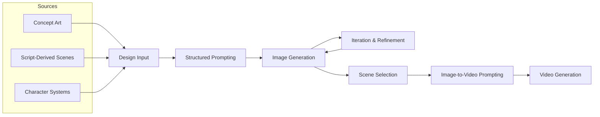
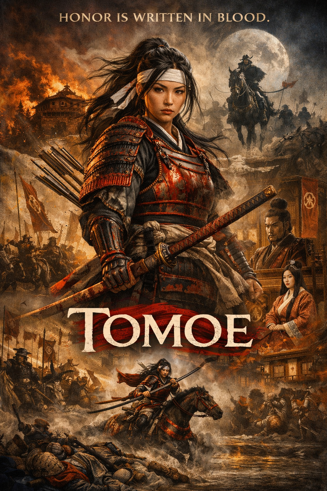
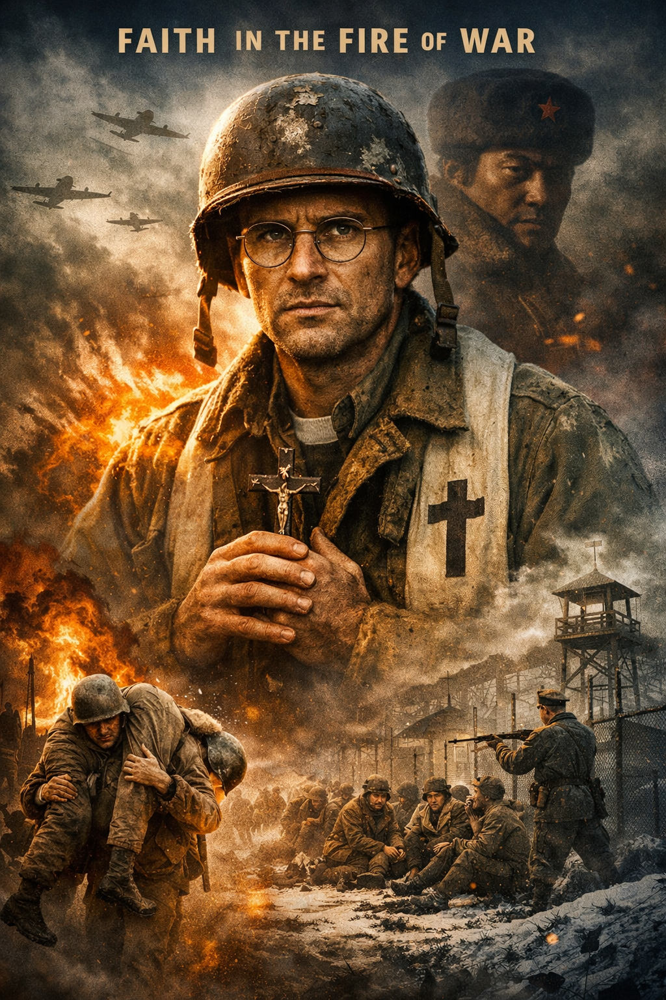
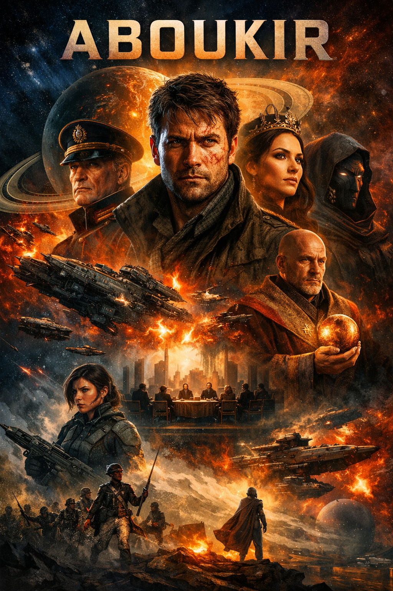
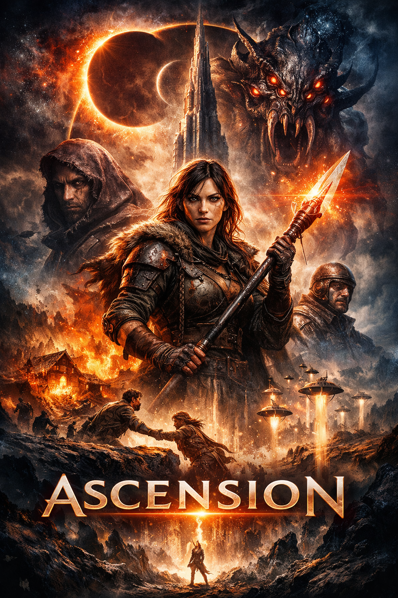
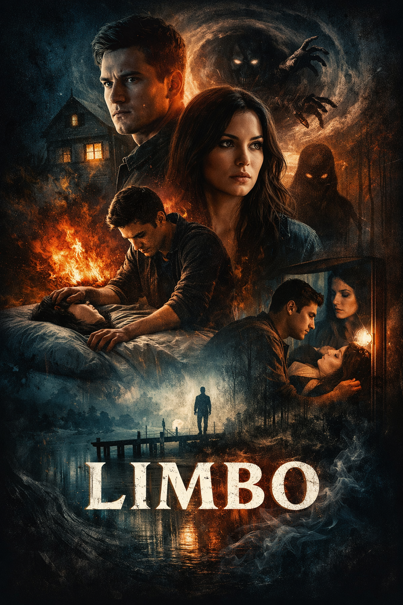
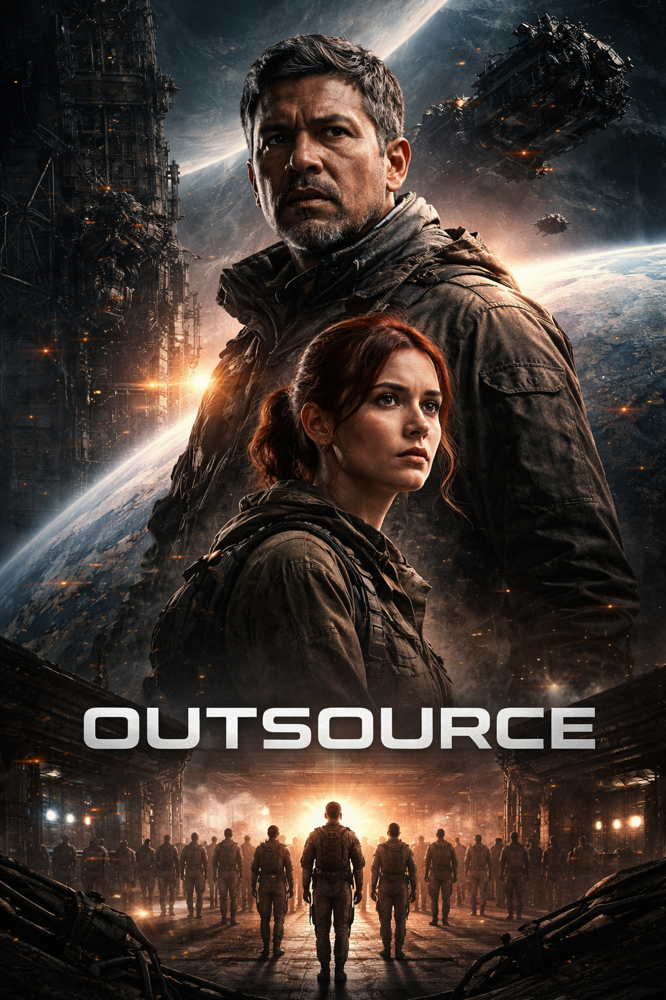

# AI Workflow Systems  
**Designing production-ready AI pipelines across generative platforms**

---

## 🚀 Overview

I design and implement **AI workflow systems** that translate creative intent into **structured, repeatable pipelines** across multiple generative tools.

This work focuses on:

- Turning fragmented AI tools into **cohesive production systems**
- Enabling **consistent, controllable outputs**
- Bridging **generative AI + real-world production workflows**

**Target Roles:**  
OpenAI — AI Success Engineer  
Runway — Creative Workflow Specialist  

---

## 🧠 Core Thesis

> AI doesn’t fail because of models.  
> It fails because of missing systems.

This repository demonstrates how to design those systems.

---

## ⚡ Core Capabilities

- Multi-stage AI workflow design  
- Cross-platform orchestration (ChatGPT, ComfyUI, Runway, Grok, Kling)  
- Structured prompting + context engineering  
- Dataset creation and LoRA training pipelines  
- AI → VFX integration (ControlNet, compositing, Nuke)  
- Workflow debugging, iteration, and optimization  
---

## End-to-End Workflow Overview

---

# 🧩 Workflow Systems

---

## 1. Production Pipeline — Creature Workflow

A full pipeline for deploying a consistent AI-generated character into live-action footage.

### 🔁 System Flow

ChatGPT → Prompt Design
→ ComfyUI (FLUX) → Image Generation
→ Dataset Creation
→ LoRA Training (FLUX → WAN)
→ ControlNet + Segmentation
→ Nuke → Final Composite

---

### 🧪 Character Design

| Final Prompt-Driven Design |
|---|
|  |

---

### 🧬 Dataset Creation

| Training Image Set |
|---|
|  |

---

### 🎬 Final Integration

| Input Plate | Final Composite |
|---|---|
|  |  |

---

### 🎯 Key Capabilities

- Dataset-driven character consistency  
- Model specialization via LoRA  
- Controlled compositing using segmentation + ControlNet  
- Integration with traditional VFX pipelines  

---

## 2. Creative Development System (ChatGPT Framework)

A structured system for using ChatGPT as a **creative engine**, not just a prompt tool.

---

### 🧠 System Design

- **Pass-Based Workflow**  
  Structured progression: logline → beats → scenes → drafts  

- **Canvas System**  
  Modular documents for scalable project development  

- **Framework Rules**  
  Controlled interaction (options, critique authority, guardrails)  

- **Visual Feedback Loop**  
  Posters + concept imagery to validate tone and direction  

---

### 🎨 Visual Iteration

| | | | | | | |
|---|---|---|---|---|---|---|
|  |  |  |  |  |  |  |

---

### 💡 Key Insight

> ChatGPT becomes exponentially more powerful when used as a **system**, not a chatbot.

---

## 3. Cross-Platform Orchestration

A strategy for coordinating multiple AI tools into a unified workflow.

---

### 🧩 System Roles

- **ChatGPT** → control layer (logic, structure, prompting)  
- **ComfyUI** → generation + parameter control  
- **Runway / Kling / Grok** → motion + iteration  
- **Nuke / After Effects** → final integration  

---

### 💡 Key Insight

> No single tool solves the pipeline.  
> Value comes from orchestration.

---

## 4. Concept → Cinematic Translation

A workflow for translating ideas into visual and animated outputs.

---

### 🔁 Pipeline

Concept / Script  
→ Structured Prompting  
→ Image Generation  
→ Iteration Loop  
→ Image → Video  

---

### 🎯 Capability

Cross-modal translation:

**Text → Image → Motion**

---

## 5. Research & Venture Workflows

Using AI workflows to explore and structure real-world projects.

### Examples

- CivicLedger  
- Prism Vocabulary Engine  
- STEAM PNKS  

---

## ⚠️ Failure Modes (Critical)

| Issue | Description | Solution |
|------|--------|----------|
| Aspect Ratio Drift | Models ignore framing | Explicit constraints |
| Style Drift | Inconsistent character | Dataset + anchor prompts |
| Temporal Instability | Video inconsistency | Constrained motion |
| Context Drift | Long session degradation | Session segmentation |
| Tool Fragmentation | Inconsistent outputs | Structured orchestration |

---

## 🚀 System Maturity

**Current Level:**
- ✅ Workflow Builder → multi-tool pipelines  
- 🟡 Moving toward System Designer → repeatability + enablement  

---

## 🔭 Next Steps

- Agentic workflows (automation loops)  
- Reusable workflow modules  
- Evaluation metrics for outputs  
- Scalable production pipelines  

---

## 🧾 Summary

This repository represents a shift from:

❌ Using AI tools individually  
→  
✅ Designing **integrated workflow systems**

---

## 🎯 Positioning Statement

I design AI workflow systems that translate creative intent into structured, repeatable pipelines across multiple generative platforms, enabling real-world production and adoption.
