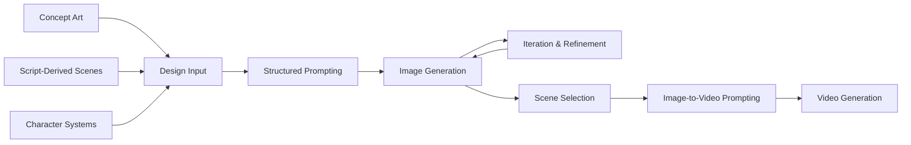

# AI Workflow Systems  
**Production, Creative, and Cross-Platform AI Workflows**

---

## Overview

This repository documents production-oriented AI workflows designed to translate generative AI capabilities into structured, repeatable systems.

The focus is not on individual tools, but on how to **design, orchestrate, and refine multi-stage workflows across platforms** to achieve consistent, production-ready results.

These workflows combine generative models, structured prompting, dataset preparation, model training, and compositing techniques into cohesive pipelines.

---

## Core Capabilities

This work centers around several key capabilities:

- Multi-step workflow design across generative AI systems  
- Cross-platform orchestration (ChatGPT, Runway, ComfyUI, Grok, Kling)  
- Prompt and context engineering tailored to specific tools  
- Workflow troubleshooting, iteration, and refinement  
- Designing systems that enable others to adopt and use AI effectively  

---

## End-to-End Workflow Overview

